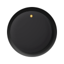
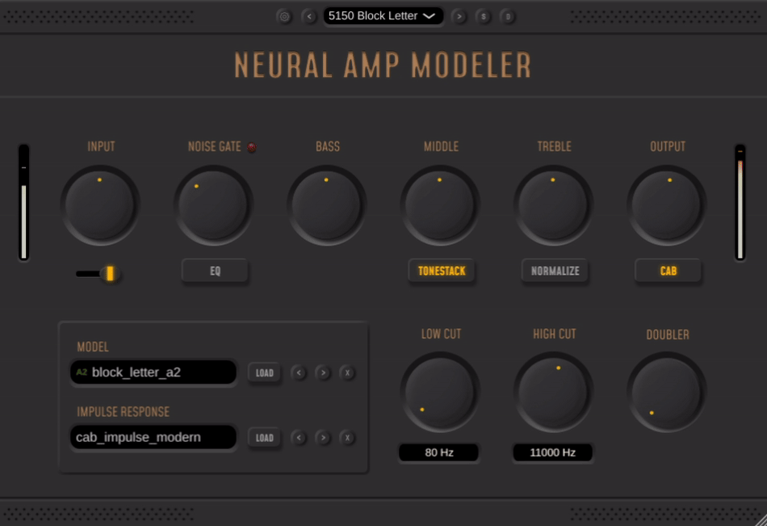
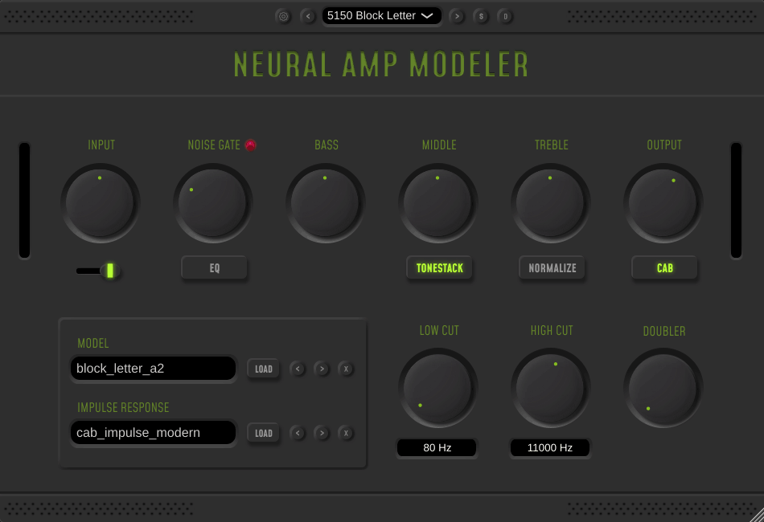
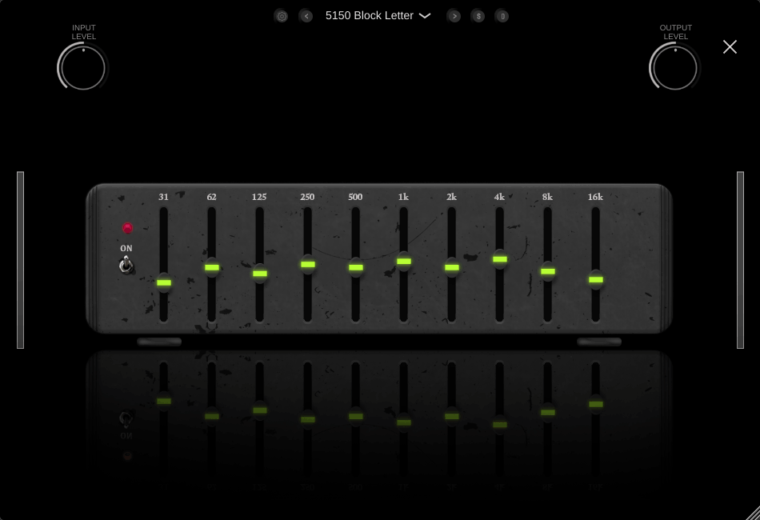
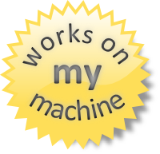

<div id="namjuce-icon" align="center">
    
    <h1>NAM JUCE</h1>
    <h3>Neural Amp Modeler JUCE Implementation</h3>
</div>


<div id="badges" align="center">

[](https://github.com/tr3m/nam-juce/releases)
[](https://community.chocolatey.org/packages/nam-juce/)
[](https://github.com/tr3m/nam-juce/blob/master/LICENSE.txt)
</div>

<div id="previews" align="center">

**A JUCE implementation of Steven Atkinson's [NeuralAmpModelerPlugin](https://github.com/sdatkinson/NeuralAmpModelerPlugin).**
<br/>

This Repository is still a work-in-progress, but the basic functionality is there.
</div>

</br>
<div align="center">
    
</div>

<div align="center">
    <table style='max-width:965px;'>
        <tr>
            <td></td>
            <td></td>
        </tr>
    </table>
</div>


## Table of Contents

1. [Installation](#installation)
    * [Releases](#releases)
    * [Chocolatey (Windows)](#chocolatey)
2. [Building](#building)
    * [Windows](#building-windows)
    * [MacOS](#building-macos)
    * [Linux](#building-linux)
    * [Optional CMake Flags](#optional-flags)
3. [Supported Platforms](#supported-platforms)
4. [Supported Formats](#supported-formats)
5. [Getting Models](#getting-models)

## <a id="installation"></a> Installation

### <a id="releases"></a> Releases
The latest versions for Windows, MacOS and Linux can be found in the [Releases](https://github.com/Tr3m/nam-juce/releases) page.

### <a id="chocolatey"></a> Chocolatey (Windows)
For windows, the Chocolatey package can be installed by running:
```bash
choco install nam-juce
```

## <a id="building"></a> Building

```bash
git clone https://github.com/tr3m/nam-juce
cd nam-juce
```

Git submodules don't need to be initialized manually. CMake will initialize the appropriate submodules depending on the defined flags.

### <a id="building-windows"></a> Windows

```bash
cmake -B build
cmake --build build --config Release -j %NUMBER_OF_PROCESSORS% 
```
The `%NUMBER_OF_PROCESSORS%` environment variable is for cmd. The Powershell/New Windows Terminal equivalent is `$ENV:NUMBER_OF_PROCESSORS`.

<br/>

> [!NOTE]
> The Standalone application build for Windows doesn't support ASIO by default.

For ASIO support a path to Steingberg's ASIO SDK needs to be provided by using the `ASIO_PATH` flag with CMake:

```bash
cmake -B build -DASIO_PATH=<path/to/asio/common>
```

<br/>

### <a id="building-macos"></a> MacOS

```bash
cmake -B build
cmake --build build -- -j $(sysctl -n hw.physicalcpu)
```

### <a id="building-linux"></a> Linux

```bash
cmake -B build
cmake --build build -- -j $(nproc)
```

Linux dependencies for JUCE can be found [here](https://github.com/juce-framework/JUCE/blob/master/docs/Linux%20Dependencies.md). Keep in mind that the packages they list are meant for Ubuntu, so you might have to do your own research depending on your distro.

### <a id="optional-flags"></a> Optional CMake Flags

* `-DUSE_NATIVE_ARCH=1`
    * Enables processor-specific optimizations for modern x64 processors.
* `-DCMAKE_PREFIX_PATH=<PATH/TO/JUCE>`
    * Use a global installation of JUCE instead of the repo submodule.
* `-DASIO_PATH=<PATH_TO_ASIO_SDK>` (Windows only)
    * Enables ASIO support for the Standalone Application.

<br/>

The resulting binaries can be found under <u>`build/NEURAL_AMP_MODELER_artefacts/Release/`</u>.

<br/>

More plug-in formats like LV2 and Legacy VST can be built by providing the appropriate SDK paths and setting the corresponding JUCE flags in the main `CMakeLists.txt` file.

## <a id="supported-platforms"></a> Supported Platforms

- Windows
- MacOS
- Linux

## <a id="supported-formats"></a> Supported Formats

- VST3
- AU
- Standalone Application

<br/>


## <a id="getting-models"></a> Getting Models

<div style="display: flex; align-items: left; gap: 8px;">
    <p style="margin: 0;">
    You can find Models and Impulse Responses shared by the community on 
        <a href="https://www.tone3000.com/">
            
        </a>
    </p> 
</div>

<br/>

##

<div align="center">
    </br>
  
</div>
